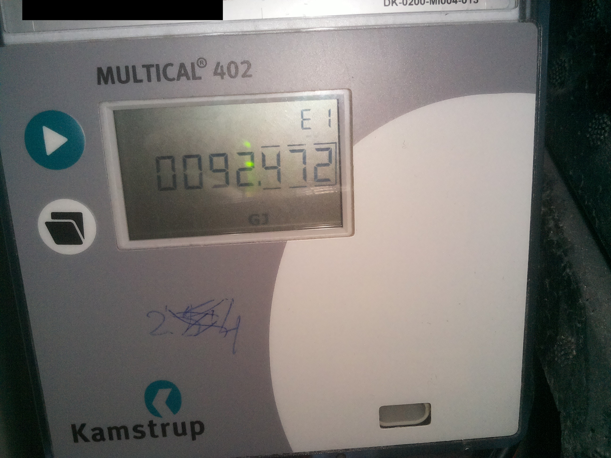
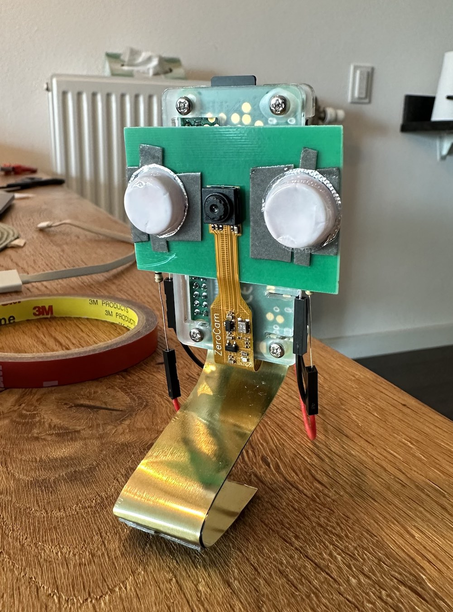
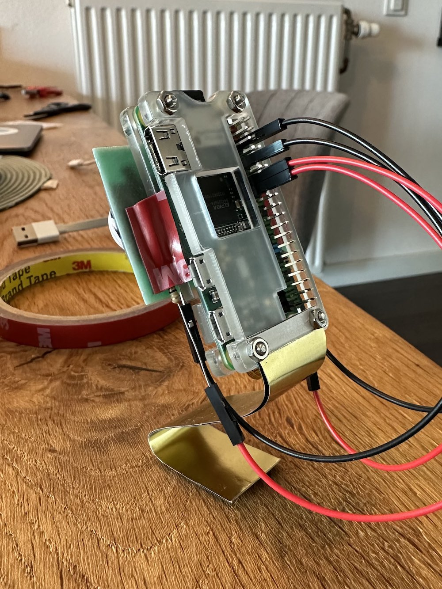

# ocr-consumed-energy-logger
Raspberry Pi project for logging OCR-ed readings from consumed energy meter.

# About
This program is used to recognize readings from energy meter like this:



and log them to Google Sheets for further analysis.

# Requirements

## Development setup

In order to develop the algorithm and experiment with OpenCV I used [Jupyter notebook](./ocr-notebook.ipynb).
To run it and other dev tools we need Python 3 and [tesseract](https://tesseract-ocr.github.io):

```shell
$ brew install tesseract
```

It is advisable to install [virtualenv](https://virtualenv.pypa.io) and create new isolated environment in the project difrectory:

```shell
$ virtualenv venv
$ source venv/bin/activate
```

Then run pip to install development dependencies:

```shell
$ pip install -r requirements.txt
```

After that one could run included Jupyter notebook in an environment of choice, for instace in [VS Code](https://code.visualstudio.com/docs/datascience/jupyter-notebooks).

## Raspberry Pi setup

To run the code on Raspbian we need to install the following dependencies (see https://singleboardblog.com/install-python-opencv-on-raspberry-pi/):

```shell
$ sudo apt-get install
```

For being able to control GPIO we need the following package:

```shell
$ sudo apt-get install rpi.gpio
```

Check [this guide](https://projects.raspberrypi.org/en/projects/getting-started-with-picamera) for installing camera in Raspberry Pi.

# Hardware

In terms of the hardware I used Raspberry Pi Zero W with [ZeroCam module](https://www.kiwi-electronics.com/en/camera-module-for-raspberry-pi-zero-3882) and it looks pretty much like this:

|  |  |
| --- | --- |

For flash I used 2 [clear LEDs](https://www.kiwi-electronics.com/en/3mm-led-clear-white-10-pack-3099) working at 3.1V and drawing 20mA. To turn them on I'll use 3.3V signal on GPIO pins. Since working voltage of the LED is lower we need to drop 3.3V down to 3.1V using dropping resitor. In order to calculate resistor parameters I used [this calculator](https://www.pcboard.ca/led-dropping-resistor-calculator) which gave me [10 ohm](https://www.kiwi-electronics.com/en/electronics-parts-components-113/passive-components-211/resistor-10-ohm-1-4-watt-5-10-pack-643).

# Credits
Tesseract traineddata for recognizing Seven Segment Display was taken from [this great repository](https://github.com/Shreeshrii/tessdata_ssd)
