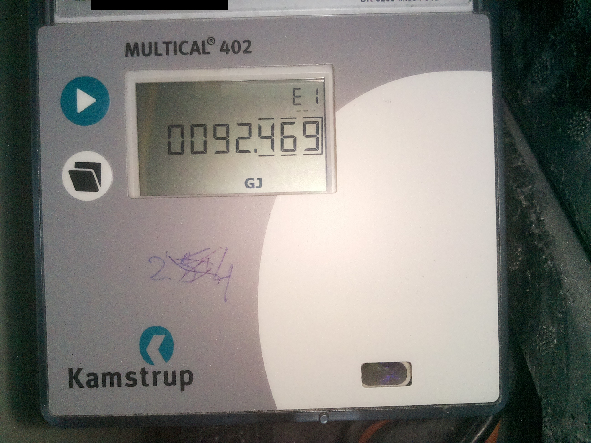

# ocr-consumed-energy-logger
Raspberry Pi project for logging OCR-ed readings from an energy meter.

# About
This script is used to recognize readings from an energy meter like this:



and log them to Google Sheets for further analysis.

# Requirements

## Development setup

The image processing and readings extraction algorithm with experiments can be found in [this Jupyter notebook](./ocr-notebook.ipynb).
In order to run it only Python 3 and [tesseract](https://tesseract-ocr.github.io) need to be installed. My development box is running Mac OS, so the following steps will assume it:

```console
user@macos$ brew install tesseract
```

It is advisable to install [virtualenv](https://virtualenv.pypa.io) and create new isolated environment in the project difrectory:

```console
user@macos$ virtualenv venv
user@macos$ source venv/bin/activate
```

Then run pip to install development dependencies:

```console
user@macos$ pip install -r requirements.txt
```

After that one should be able to run included Jupyter notebook in an environment of choice, for instance in [VS Code](https://code.visualstudio.com/docs/datascience/jupyter-notebooks).

# Hardware

In terms of the hardware the code has been tested on Raspberry Pi Zero W with [ZeroCam module](https://www.kiwi-electronics.com/en/camera-module-for-raspberry-pi-zero-3882) and the setup looks pretty much like this:

|  |  |
| --- | --- |

For highlighting the scene the board is using 2 [clear LEDs](https://www.kiwi-electronics.com/en/3mm-led-clear-white-10-pack-3099) working at 3.1V and drawing 20mA. To turn them on we'll output a 3.3V signal on GPIO pins. Since the working voltage of an LED is lower we need to drop 3.3V down to 3.1V using dropping resitor. In order to calculate resistor parameters I used [this calculator](https://www.pcboard.ca/led-dropping-resistor-calculator) which gave me [10 ohm](https://www.kiwi-electronics.com/en/electronics-parts-components-113/passive-components-211/resistor-10-ohm-1-4-watt-5-10-pack-643). More about [controlling LEDs via GPIO](https://www.freecodecamp.org/news/hello-gpio-blinking-led-using-raspberry-pi-zero-wh-65af81718c14/).

## Raspberry Pi setup

To run the energy logger code on Raspbian we need to install a number of dependencies. First, we need OpenCV dependencies and tesseract OCR engine. Note, that all the commands prefixed with `user@raspberrypi` will need to be executed on Raspberry Pi:

```console
user@raspberrypi$ sudo apt-get update 
user@raspberrypi$ sudo apt-get install python3-opencv tesseract-ocr
```

Then create `energy-logger` user for running the app and add it to `gpio` and `video` groups:

```console
user@raspberrypi$ sudo adduser energy-logger
user@raspberrypi$ sudo adduser energy-logger gpio
user@raspberrypi$ sudo adduser energy-logger video
```

Now, copy the `app` directory to the home directory of the `energy-logger` user. On the host computer run:

```console
user@macos$ scp -r ./app energy-logger@raspberrypi.local:~
energy-logger@raspberrypi.local's password:
```

Type `energy-logger`'s password when asked. After command completes the `app` directory should appear in `energy-logger` user home directory. Note that it's rather bad security practice to allow ssh password authentication, but for the sake of simplicity we use Raspbian defaults here. Read [here](https://www.cyberciti.biz/faq/how-to-disable-ssh-password-login-on-linux/) to learn how to disable SSH password authentication.

And then we can install energy logger Python dependencies (on the Raspberry Pi):

```console
user@raspberrypi$ sudo su energy-logger
energy-logger@raspberrypi$ cd ~/app
energy-logger@raspberrypi$ pip install -r requirements.txt
```

Check [this guide](https://projects.raspberrypi.org/en/projects/getting-started-with-picamera) for installing camera on Raspberry Pi.

Additionally, you'll need to create new Google API project, create a service account and retrieve Google Sheets API access credentials in order to be able to log readings to a spreadsheet. Follow the guide [here](https://robocorp.com/docs/development-guide/google-sheets/interacting-with-google-sheets) and save credentials to `credentials.json` file and put it to the `app` directory on Raspberry Pi. Also, don't forget to lock down file permissions (those are secrets after all):

```console
energy-logger@raspberrypi$ chmod 600 credentials.json
```

Now, we need to schedule the logger to be executed let's say once every hour. To do that add the following line to `/etc/crontab`:

```
10 * * * * energy-logger SHEET_ID="{YOUR-SHEET-ID}" SHEET_RANGE="{YOUR-SHEET-RANGE}" /home/energy-logger/app/energy_logger.py 2>&1 | /usr/bin/logger -t energy-logger
```

where `{YOUR-SHEET-ID}` can be obtained from a Google Sheets document URL and `{YOUR-SHEET-RANGE}` should be something like `Sheet1!A1:B1`.

# Credits
Tesseract traineddata for recognizing Seven Segment Display was taken from [this great repository](https://github.com/Shreeshrii/tessdata_ssd)
